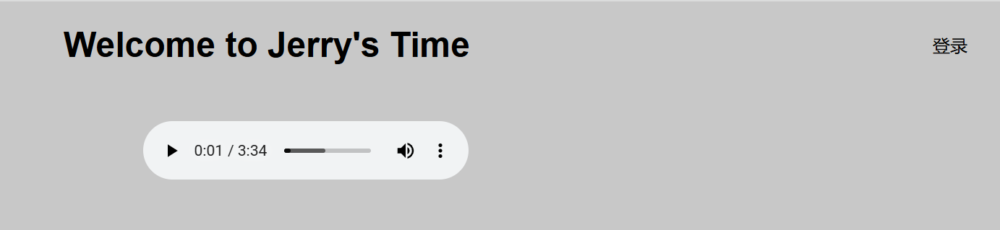

## 项目概述

- **项目效果**

	

- **来源**：独立项目

- **文件**：

	- **后端**：`app.py`
	- **数据库**：SQLite
	- **前端**：`index.html` `header.html` `login.html` `register.html` `user-profile.html`

- **概述**：这是一个练习项目，后端采用 Flask 框架，数据库使用 SQLite，前端没有使用框架。

- **功能**：

	- 每个页面都有公共的页眉。

	- 真实注册和登录。

	- 登录以后记录登录状态，原登录按钮显示为用户名。

	- 可以退出登录，切换登录状态。

- **存储**

	- 代码存储在 Git 托管平台：前后端合并存储 `login-flask-sqlite-html`
	- 无镜像存储在 DockerHub